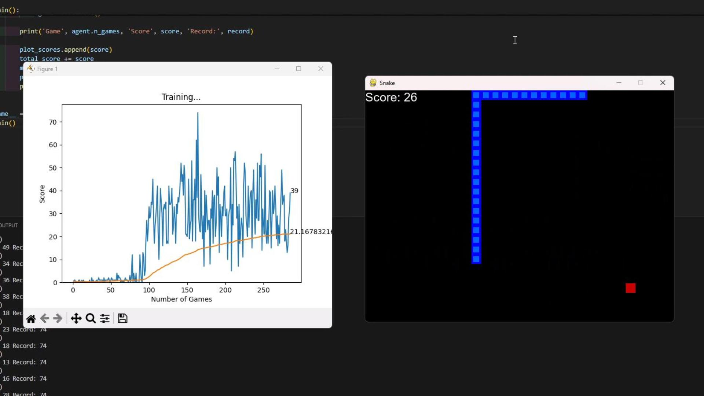

# Snake AI

Snake AI is a reinforcement-learning project that trains a PyTorch deep Q-learning agent to play Snake. The agent observes an 11-feature representation of the game, chooses between three relative movement actions, and learns from rewards, collisions, and replayed experience.

**Observed best score:** approximately 70 food items in a single game.

## Demo

[](https://youtu.be/cHPOxD0hUVE)

Click the image to watch the trained agent play.

## How the Agent Works

### State representation

The game is represented with 11 binary features:

- Danger immediately straight ahead
- Danger immediately to the right
- Danger immediately to the left
- Current direction: left, right, up, or down
- Food location relative to the head: left, right, up, or down

This compact state gives the agent information about immediate collisions, its orientation, and the direction of its objective without passing the full game board to the model.

### Action space

The model chooses one of three relative actions:

```text
[1, 0, 0] → continue straight
[0, 1, 0] → turn right
[0, 0, 1] → turn left
```

Relative actions prevent the agent from reversing directly into its body and allow the same policy to work in every absolute direction.

### Reward function

| Event | Reward |
| --- | ---: |
| Eat food | `+10` |
| Hit a wall or the snake's body | `-10` |
| Normal movement | `0` |

An episode also ends when the agent goes too long without eating, preventing infinite loops.

### Neural network

The Q-network is a fully connected PyTorch model:

```text
11 state features → 256-unit hidden layer with ReLU → 3 action values
```

The three outputs estimate the value of continuing straight, turning right, or turning left from the current state.

### Training

- Online update after every action
- Replay memory containing up to 100,000 transitions
- Random replay batches of up to 1,000 transitions
- Adam optimizer with a `0.001` learning rate
- Mean squared error loss
- Discount factor of `0.9`
- Exploration that decreases as more games are completed
- Automatic CUDA use when a compatible GPU is available, with CPU fallback

After each episode, the agent trains on replayed experience and updates a live Matplotlib graph containing the individual and mean scores. When a new record is reached, the model weights are saved to `model/model.pth`.

## Game Environment

The Pygame environment runs on a `640 × 480` grid with 20-pixel cells. Each food item increases the score by one and lengthens the snake. Episodes end after a wall collision, self-collision, or extended period without food.

## Run Locally

### Requirements

- Python 3
- PyTorch
- NumPy
- Pygame
- Matplotlib
- IPython

### Setup

```bash
git clone https://github.com/Jamez43/SnakeAI.git
cd SnakeAI
python -m venv .venv
source .venv/bin/activate
pip install -r requirements.txt
```

On Windows, activate the environment with:

```powershell
.venv\Scripts\activate
```

Start training:

```bash
python agent.py
```

Training continues until the Pygame window is closed. The game window shows the current episode while Matplotlib displays score history.

## Repository Structure

```text
├── agent.py          State encoding, policy, replay memory, and training loop
├── model.py          Q-network, optimizer, loss, and model saving
├── snake_game.py     Pygame environment, rewards, movement, and collisions
├── helper.py         Live score and mean-score visualization
├── model/model.pth   Saved weights from the best observed training episode
├── thumbnail.png     Demo-video thumbnail
└── requirements.txt  Python dependencies
```

## Results and Limitations

The agent reached an observed best score of approximately 70 food items in a single game. This is a best-case observation rather than a formal benchmark; the repository does not currently include a fixed-seed evaluation harness or aggregate evaluation across multiple trained runs.

The 11-feature state is efficient, but it only describes immediate danger and relative food direction. It does not provide the complete board layout, so the agent cannot explicitly plan long routes or reason about whether its body is creating a future trap.

## Possible Improvements

- Add a separate evaluation mode that loads saved weights without training
- Report mean, median, and variance across fixed-seed evaluation games
- Save training checkpoints and configuration metadata
- Compare the compact state with a full-grid convolutional model
- Add automated tests for movement, collision, and reward behavior
